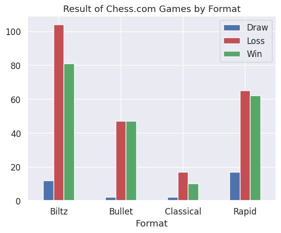

# Chess com game analysis for particular player

This is basically a analysis of particular players game in Chess.com 
Chess.com is one of the most used online platform for playing the game of chess

## In this Project
- We have used api provided by chesscom for grabbing the data
- The data is retrieved on the basis username given for particular user/player
- We use chess library to read the PGN format data for chess game data
- We used glob to read the file of same pattern at once
- And basic analysis and data preparation using matplotlib,seaborn and pandas.

